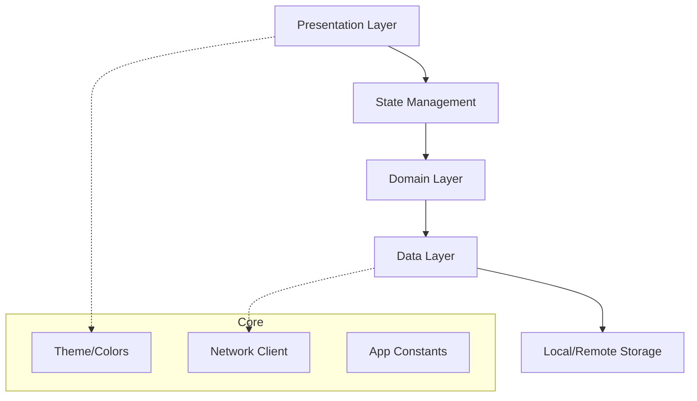
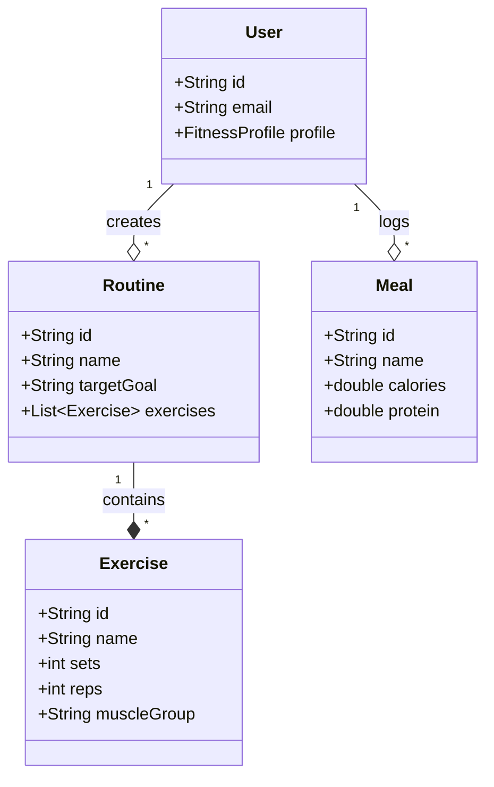
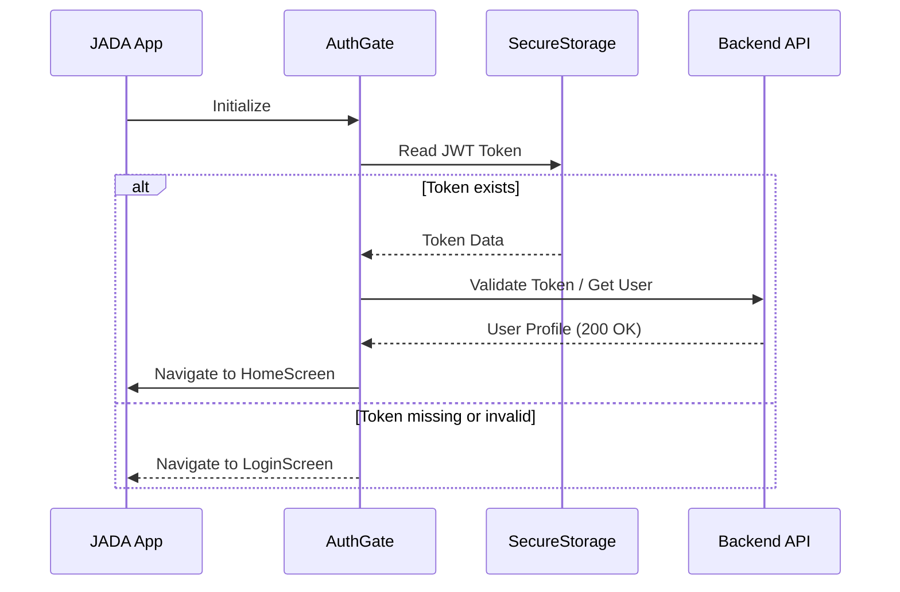
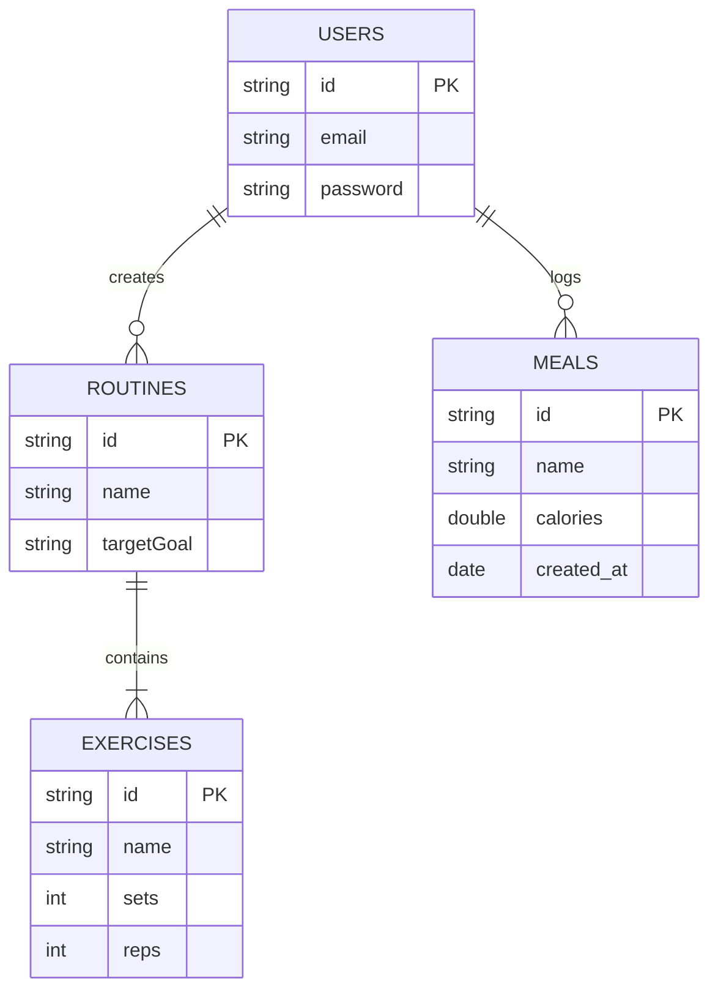
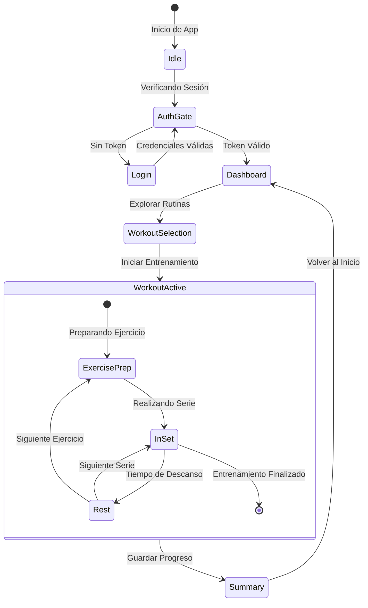

# JADA FIT - The Ultimate AI Fitness Ecosystem


JADA FIT es una plataforma integral de salud y alto rendimiento que utiliza Inteligencia Artificial para personalizar cada aspecto de la vida del usuario: desde entrenamientos dinámicos hasta nutrición de precisión y bienestar mental.

---

## 🚀 Características Principales

- **Coach IA Contextual**: Un asistente disponible 24/7 que recuerda tu progreso, lesiones y preferencias.
- **Rutinas Adaptativas**: Generación de entrenamientos que se ajustan en tiempo real según tu fatiga y equipo disponible.
- **Nutrición Inteligente**: Seguimiento de macros sincronizado con tu gasto calórico real.
- **Interfaz Premium**: Diseño basado en *glassmorphism* y neuroestética para maximizar la motivación.
- **Social & Gamificación**: Desafíos comunitarios y sistema de progresión por niveles.

---

## 🏗️ Arquitectura del Proyecto

El proyecto sigue una arquitectura **limpia y modular orientada a Features**, facilitando la escalabilidad y el mantenimiento.

### Estructura de Directorios

```text
lib/
├── core/              # Lógica compartida, temas, constantes y servicios base
│   ├── network/       # Gestión de APIs y excepciones
│   ├── theme/         # Sistema de diseño (AppColors, AppTheme)
│   └── storage/       # Persistencia segura (JWT, Preferencias)
├── features/          # Módulos independientes por funcionalidad
│   ├── auth/          # Login, Registro y AuthGate
│   ├── workout/       # Rutinas, Ejercicios y Seguimiento
│   ├── nutrition/     # Dieta, Macros y Comidas
│   └── ai/            # Chatbot y lógica de procesamiento IA
└── main.dart          # Punto de entrada de la aplicación
```

---

## 📊 Diseño del Sistema (UML)

### 1. Diagrama de Arquitectura de Capas
Representa cómo fluye la información entre las diferentes capas de la aplicación.



### 2. Diagrama de Clases (Core Entities)
Modelo conceptual de las entidades principales del sistema de entrenamiento.



### 3. Flujo de Autenticación (Sequence Diagram)
Proceso de validación de sesión al iniciar la app.



### 4. Modelo de Base de Datos (ERD)
Estructura relacional de las entidades en el backend.



---

## 🛠️ Tech Stack

- **Framework**: Flutter 3.x
- **Lenguaje**: Dart 3.x
- **Gestión de Estado**: Provider
- **Persistencia**: Flutter Secure Storage (Encriptado)
- **Networking**: HTTP con Interceptores de Error
- **UI/UX**: Custom Material Design con soporte para modo oscuro avanzado.

---

## 🛠️ Instalación y Configuración

1. **Clonar el repositorio**:
   ```bash
   git clone https://github.com/tu-usuario/JADA-Fit-front.git
   ```
2. **Instalar dependencias**:
   ```bash
   flutter pub get
   ```
3. **Configurar variables de entorno**:
   Crea un archivo `.env` o configura tus constantes en `lib/core/constants/api_constants.dart`.
4. **Ejecutar la app**:
   ```bash
   flutter run
   ```

---

## 🧩 Flujos de Usuario y Estados (State Diagram)

Para entender cómo JADA FIT gestiona la experiencia del usuario durante un entrenamiento, utilizamos el siguiente diagrama de estados:



---

## 🛠️ Detalles de Implementación Técnica

### Gestión de Estado
Utilizamos **Provider** para manejar el estado de forma reactiva en toda la aplicación. Esto nos permite desacoplar la lógica de negocio de la interfaz de usuario y notificar cambios en tiempo real.

### Seguridad y Persistencia
- **JWT (JSON Web Tokens)**: Todas las peticiones a la API están protegidas.
- **AES Encryption**: Los tokens y datos sensibles se almacenan localmente usando el llavero del sistema a través de `flutter_secure_storage`.

---

## 📈 Roadmap de Desarrollo

- [x] **Fase 1: UI Premium & Core Auth**
  - Refactorización completa de la pantalla de rutinas con estilo Glassmorphism.
  - Flujo de autenticación con persistencia segura.
- [ ] **Fase 2: Motor de IA & Visión**
  - Implementación de JADA Vision para corrección biomecánica.
  - Integración de voz para el AI Coach.
- [ ] **Fase 3: Ecosistema & Wearables**
  - Conexión con Apple HealthKit y Google Fit.
- [ ] **Fase 4: Expansión Corporativa**
  - Dashboard para empresas y retos grupales.

---

## 📝 Licencia

Este proyecto está bajo la Licencia MIT. Consulta el archivo `LICENSE` para más detalles.